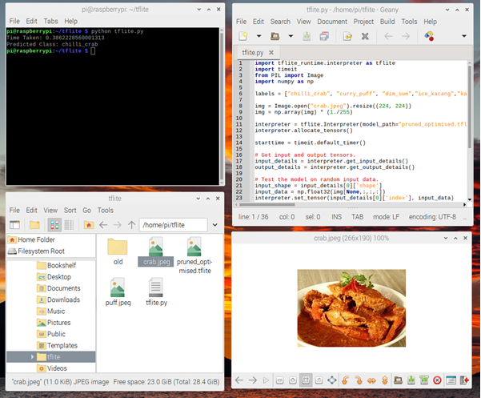

## Introduction

This repository records my exploration of depolying a model on a Raspberry Pi v3.

## Model

The model that was used was a MobileNet V2 model (with 2 fully connected layers as the classification head) using pre-trained weights from Tensorflow Hub and fine tuned on a classification dataset of various food in Singapore. There are 12 classes within the dataset which are: chilli_crab, curry_puff, dim_sum, ice_kacang, kaya_toast, nasi_ayam, popiah, roti_prata, sambal_stingray, satay, tau_huay and wanton_noodle.

## Pruning and Quanisation

I followed the official guide from Tensorflow to prune and quantise the model. 

https://www.tensorflow.org/model_optimization/guide/pruning/pruning_with_keras

This resulted in the model.tflite file that is included in this repository.

## Inference on the Raspberry Pi

I then followed the official guide from Tensorflow to install the Tensorflow Lite Runtime Interpreter on the Raspberry Pi.

https://www.tensorflow.org/lite/guide/python

Finally, inference was carried out on the Raspberry Pi using tflite_inference.py included in this repository.

